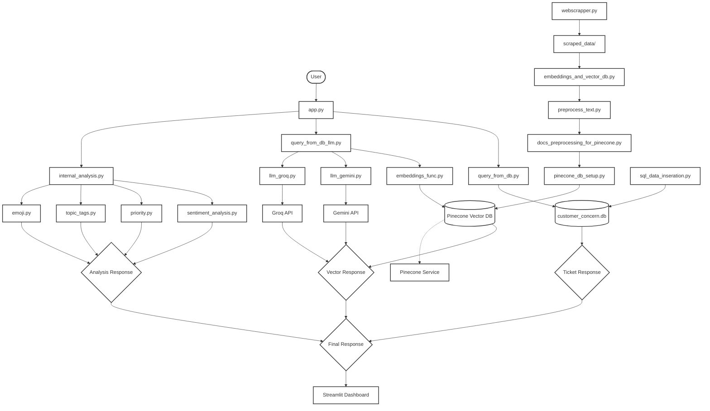

# Customer Support Intelligence System

An AI-powered customer support system that automatically analyzes, classifies, and responds to customer tickets using sentiment analysis, priority classification, topic tagging, and intelligent document retrieval.                        
Deployed Link: https://sh-ubhamprakash-support-copilot-ai.streamlit.app/ 

## Note: 
The Streamlit app may take some time to load and process insights after you upload the JSON file, so please be patient. The app has been thoroughly tested and works well locally. However, in the deployed version, occasional server-side issues may occur such as the web app misbehaving or data not loading even after multiple attempts which are not present in the local environment. 


## 🎯 Features

### Core Intelligence Capabilities
- **Sentiment Analysis**: Automatically detects customer emotions using DistilBERT model
- **Priority Classification**: Categorizes tickets as High/Medium/Low priority using rule-based and LLM approaches
- **Topic Tagging**: Classifies tickets into categories (How-to, Product, Connector, Lineage, API/SDK, SSO, Glossary, Best practices, Sensitive data)
- **Intelligent Response Generation**: Uses RAG (Retrieval-Augmented Generation) to provide contextual responses

### Interactive Dashboard
- **Classification Dashboard**: Real-time visualization of ticket sentiment distribution with bar and pie charts
- **Interactive AI Bot**: Chat interface for immediate ticket analysis and response
- **Ticket Lookup**: Direct database queries using ticket numbers

### Data Processing Pipeline
- **Web Scraping**: Automated documentation collection from multiple domains
- **Vector Database**: Pinecone integration for semantic search and document retrieval
- **Document Processing**: Text preprocessing, chunking, and embedding generation

## 🏗️ Architecture

### System Components




### Key Technologies
- **Frontend**: Streamlit with interactive visualizations
- **ML Models**: 
  - Sentence Transformers (all-MiniLM-L6-v2) for embeddings
  - DistilBERT for sentiment analysis
- **Vector Database**: Pinecone with cosine similarity search
- **LLMs**: Google Gemini and Groq (Gemma2-9b-it)
- **Data Processing**: LangChain text splitters, concurrent processing

## 📦 Installation

### Prerequisites
- Python 3.8+
- Required API keys (see Environment Setup)

### Quick Start
```bash
# Clone the repository
git clone https://github.com/ShubhamPrakash108/helpdesk-copilot.git
cd customer-support-system

# Install dependencies
pip install -r requirements.txt


# Edit .env with your API keys

# Run the application
streamlit run app.py
```

### Environment Setup
Create a `.env` file with the following variables:
```env
PINECONE_API_KEY=your_pinecone_api_key
PINECONE_INDEX_NAME=your_index_name ( when you want to insert the data to your own pinecone database, script is written, it is in the helper_functions folder )
GEMINI_API_KEY=your_gemini_api_key
GROQ_API_KEY=your_groq_api_key
GROQ_API_KEY_2=your_backup_groq_api_key
```

## 🚀 Usage

### 1. Data Preparation ( NOT REQUIRED, YOU CAN DIRECTLY RUN THE WEB APP USING THE STREAMLIT RUN APP.PY COMMAND)
```bash
# Scrape documentation (optional - sample data included)
python helper_functions/webscrapper.py

# Process and create embeddings
python helper_functions/embeddings_and_vector_db.py
python helper_functions/pinecone_db_setup.py
```

### 2. Launch Dashboard
```bash
streamlit run app.py
```

### 3. Using the System

#### Classification Dashboard
1. Upload a JSON file containing ticket data or use sample data
2. Watch real-time sentiment analysis with live chart updates
3. Explore detailed ticket breakdowns with priority and topic classifications

#### Interactive AI Bot
1. Enter a customer concern or ticket number (format: TICKET-XXX)
2. Get instant analysis including:
   - Sentiment and emotion detection
   - Priority assessment
   - Topic classification
   - AI-generated response (for relevant topics)

## 📊 Data Formats

### Input Ticket Format
```json
[
  {
    "id": "TICKET-001",
    "subject": "Connection issue with Snowflake",
    "body": "I'm having trouble connecting Snowflake to Atlan. What permissions are required?"
  }
]
```

### Analysis Output
```json
{
  "sentiment": "confusion",
  "emoji": "😕",
  "topics": "Connector",
  "priority": "Medium_Priority"
}
```

## 🔧 Configuration

### Model Settings
- **Embedding Model**: sentence-transformers/all-MiniLM-L6-v2 (384 dimensions)
- **Sentiment Model**: joeddav/distilbert-base-uncased-go-emotions-student
- **Text Chunking**: 1000 characters with 200 character overlap
- **Vector Search**: Top 10 matches with cosine similarity

### Performance Optimization
- **Concurrent Processing**: Multi-threading for embedding generation
- **Batch Processing**: 100-vector batches for Pinecone uploads
- **Caching**: Local model storage to reduce download times
- **API Rate Limiting**: Built-in delays and multiple API key rotation

## 🎨 Dashboard Features

### Visualization Components
- **Real-time Charts**: Dynamic bar and pie charts showing sentiment distribution
- **Color-coded Emotions**: 27 distinct emotions with unique color mapping
- **Interactive Expandables**: Detailed ticket view with formatted content
- **Progress Tracking**: Live progress bars during batch processing

### UI Enhancements
- **Gradient Backgrounds**: Emotion-specific styling for better visual hierarchy
- **Responsive Design**: Optimized for different screen sizes
- **Hover Effects**: Interactive elements with smooth transitions
- **Custom CSS**: Branded styling with consistent theme

## 🔍 Technical Details

### Sentiment Analysis
Uses a fine-tuned DistilBERT model trained on the GoEmotions dataset, capable of detecting 28 different emotions including joy, anger, confusion, and neutral states.

### Priority Classification
Implements a hybrid approach:
1. **Rule-based**: Pattern matching for explicit priority keywords
2. **LLM-based**: Fallback to language models for ambiguous cases

### RAG Implementation
- **Document Retrieval**: Semantic search using vector embeddings
- **Context Integration**: Relevant documentation chunks provided to LLMs
- **Response Generation**: Contextual answers with source attribution
- **Relevance Filtering**: Only provides AI responses for product-related topics

### Performance Metrics ( depends on system )
- **Embedding Speed**: ~50 documents/second with multi-threading
- **Search Latency**: <500ms for vector similarity search 
- **Classification Accuracy**: High precision for priority and topic detection
- **Response Time**: 2-5 seconds for complete ticket analysis


## 🤖 AI Models & APIs

### Language Models
- **Google Gemini 2.5 Flash**: Primary LLM for response generation
- **Groq Gemma2-9b-it**: Backup LLM with faster inference

### Machine Learning Models
- **Sentence Transformers**: Semantic embeddings for document retrieval
- **DistilBERT**: Efficient sentiment and emotion classification

### Vector Database
- **Pinecone**: Serverless vector database with sub-second search
- **Configuration**: 384-dimensional vectors, cosine similarity, AWS us-east-1

## 📈 Monitoring & Analytics

### Real-time Metrics
- **Processing Speed**: Live updates during batch operations
- **Sentiment Distribution**: Dynamic visualization of customer emotions
- **Topic Trends**: Classification breakdown by support categories
- **Response Quality**: Context relevance scoring

### Error Handling
- **API Fallbacks**: Multiple API key rotation for reliability
- **Graceful Degradation**: Rule-based fallbacks when LLMs are unavailable
- **Input Validation**: Comprehensive error checking and user feedback
- **Rate Limiting**: Built-in delays to respect API quotas

## 🔒 Security & Privacy

### Data Protection
- **Environment Variables**: Secure API key management
- **Local Processing**: Sentiment analysis runs locally
- **No Data Persistence**: Temporary processing without permanent storage
- **Access Control**: API key-based authentication for external services

## 🚀 Deployment Options

### Local Development
```bash
streamlit run app.py
```


## 📄 License

This project is licensed under the MIT License - see the LICENSE file for details.

## 🤝 Contributing

Contributions are welcome!
